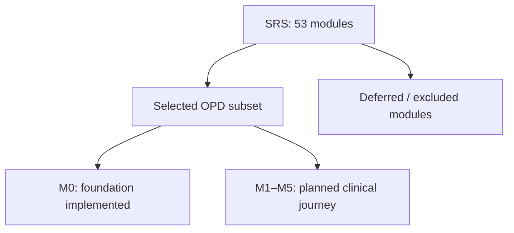
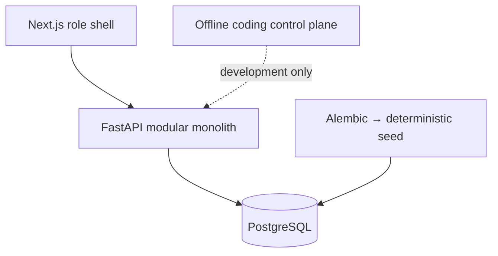

# OmniMed Solo POC · v0.1

Starter สำหรับพัฒนา OPD vertical slice ตาม OmniMed SRS v2.0 ด้วย Python/FastAPI, Next.js และ PostgreSQL. รอบนี้ implement **M0 Foundation**: เปิดหน้าจอสำรวจ 7 บทบาท ตรวจสถานะบริการ รัน migration และ seed metadata สังเคราะห์. Patient registration, CPOE, ผลตรวจ, จ่ายยา, billing และ login ยังเป็นงาน M1–M5

**สถานะ candidate:** backend/frontend gates ที่รันได้ผ่านแล้ว; Docker image startup, live PostgreSQL และ Compose browser suite ยังต้องผ่านบนเครื่องที่มี Docker ก่อนประกาศ M0 release PASS. ดูผลพร้อมหลักฐานใน [FINAL_DELIVERY_REPORT](validation/FINAL_DELIVERY_REPORT.md). Railway มี configuration และคู่มือ แต่ยังไม่ได้ deploy จริง

## ขอบเขต



เป้าหมายถัดไปคือ Registration → Encounter → Triage → Doctor/CPOE → Lab → Medication → Dispense → Charge → Completion โดยใช้ Somchai Demo และข้อมูลสังเคราะห์เท่านั้น. A01–A10 ยังไม่ใช่ passed tests. ดู [POC contract](docs/POC_CONTRACT.md), [trace](docs/REQUIREMENT_TRACE.md) และ [acceptance scenarios](docs/ACCEPTANCE_TESTS.md)

Starter นี้ไม่ใช่ full HIS, ระบบพร้อมใช้งานทางคลินิก, production IAM หรือหลักฐาน PDPA/FHIR compliance. ไม่มี clinical AI, device integration, real stock, government submission หรือ paid model dependency

## Architecture



Compose เป็น deployment หลักของ local/on-premise; Next.js และ FastAPI เป็นส่วนของแอปเดียวกัน ไม่ใช่ domain microservices. ไม่มี broker และไม่มี LLM ใน request path. Railway ใช้ Dockerfiles ชุดเดียวกัน รายละเอียดอยู่ใน [DEMO_DEPLOYMENT.md](DEMO_DEPLOYMENT.md)

## เริ่มในเครื่อง

ติดตั้ง Docker Engine + Compose v2.24.4 ขึ้นไป หรือ Docker Desktop และ Python 3.12. เปิด Docker แล้วรันจาก root ของ repo:

```sh
python scripts/dev.py up
```

ครั้งแรก script สร้าง `.env` พร้อม password ฐานข้อมูลแบบสุ่ม จากนั้น build, รอ PostgreSQL, migrate, seed และรอ health ของ backend/frontend. เปิด [localhost:3000](http://localhost:3000). ครั้งแรกต้องดาวน์โหลด images/packages; subsequent local runtime ไม่เรียก external API

```sh
python scripts/dev.py status
python scripts/dev.py logs
python scripts/dev.py down
```

`down` เก็บ volume ฐานข้อมูลไว้. ถ้า port 3000/8000/5432 ถูกใช้ ให้หยุด service ที่ชนหรือแก้เฉพาะ host port ใน Compose; `status` helper ใช้ default ports. อย่ารัน `down --volumes` กับข้อมูลที่ต้องเก็บ. ขั้นตอนติดตั้ง dependencies/native development, migration และ recovery อยู่ใน [LOCAL_VALIDATION](docs/LOCAL_VALIDATION.md)

## ตรวจงาน

```sh
uv sync --frozen --extra dev
cd frontend
npm ci
cd ..
python scripts/checks.py
```

Basic check รัน unit tests, lint, typecheck, build, tooling และ trace checks; รายการที่ไม่รันแสดง NOT_RUN. Full gate ใช้ Docker และ Chromium:

```sh
cd frontend
npx playwright install --with-deps chromium
cd ..
python scripts/checks.py --full
```

Full gate สร้าง Compose project ชั่วคราวแยกจากงานของคุณ ตรวจ image startup, database health, migration up/down/up, seed ซ้ำ, tenant constraints, UI และ database outage แล้วลบเฉพาะ test project/volume. ผลอยู่ `validation/local-checks/`. GitHub workflow ใช้คำสั่งเดียวกัน; การมี workflow ไม่ได้แปลว่า CI เคยผ่านแล้ว

## Demo roles

| Role | หน้าจอที่สำรวจได้ |
|---|---|
| R-REG | ทะเบียนผู้ป่วย |
| R-SCR | คัดกรอง |
| R-DOC | ห้องตรวจ/CPOE |
| R-LAB | ห้องปฏิบัติการ |
| R-PHA | เภสัชกรรม |
| R-FIN | ค่าใช้จ่าย ไม่มี clinical header |
| R-ADMIN | ตั้งค่าระบบสาธิต ไม่มี clinical chart |

**ไม่มี username/password สำหรับเข้าสู่ระบบใน M0.** Seed มี 7 non-login identity fixtures; role selector เปลี่ยนหน้าจอเท่านั้น. `/api/foundation` ระบุชัดว่า authentication, clinical endpoints และ access grants ยังปิดอยู่. [Security boundary](docs/SECURITY_BOUNDARY.md) กำหนด deny-by-default และ read audit ตั้งแต่ protected API แรกใน M1

## FHIR และ roadmap

| Milestone | เนื้อหา | สถานะ |
|---|---|---|
| M0 | Runtime, seed framework, UI shell, docs/control plane | Implemented; runtime verification pending |
| M1 | Party/Patient, HN, patient search, OPD encounter | Planned |
| M2 | Observation, vitals, triage | Planned |
| M3 | Catalog, lab/medication order, revisions | Planned; revision ADR pending |
| M4 | Lab provenance/results, dispense, event-derived charge | Planned |
| M5 | RBAC/audit completion, FHIR export, end-to-end demo | Planned; closure decisions pending |

FHIR R4 Patient, Encounter, Observation, ServiceRequest และ MedicationRequest มี [mapping document](docs/FHIR_MAPPING.md) เท่านั้น. Export/search/write endpoints และ conformance validation ยังไม่ได้ implement. M5 จะ validate เฉพาะ supported subset

อ่าน [LEARNING_GUIDE](docs/LEARNING_GUIDE.md) หากเริ่มเรียนจาก repo. ให้ Codex อ่าน [HANDOFF_TO_CODEX](HANDOFF_TO_CODEX.md) แล้วปิด runtime gate [M0-01](docs/tasks/M0-01.md); feature task แรกคือ [M1-01](docs/tasks/M1-01.md). ไม่ต้องอ่าน SRS ทั้งฉบับทุกรอบ

## References / provenance

ใช้ OpenMRS, Bahmni, OpenELIS Global และ HAPI FHIR เพื่อเทียบแนวคิด; Codex, Agents SDK, OpenHands, CrewAI และ OpenRouter เป็น developer-tooling study. Hallmark/No AI Slop ใช้แนวคิดในการตรวจ UI/copy. ไม่มี reference framework เหล่านี้ใน product runtime. รายการ source URLs, การตัดสินใจใช้/ไม่ใช้ และ license อยู่ใน [REFERENCE_AUDIT](docs/REFERENCE_AUDIT.md) และ [LICENSE_NOTE](LICENSE_NOTE.md). ห้ามเผยแพร่ SRS/mockup ต่อโดยอนุมานสิทธิ์จากการแนบไฟล์
