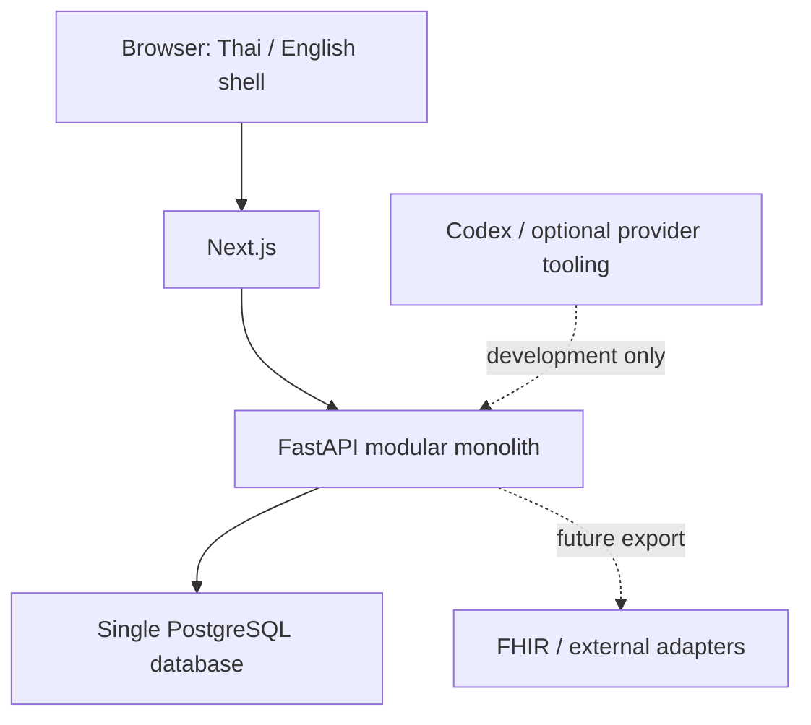

# Architecture — M0 and target boundary

M0 เป็น modular-monolith foundation. ปัจจุบัน backend มีเพียง foundation module; ยังไม่มี patient/order/lab modules ที่แกล้งทำงาน. เอกสารนี้กำหนดทิศทางให้สร้างทีละ task

| Boundary | Owns | Current implementation |
|---|---|---|
| Frontend | Role navigation preview, empty worklists, localized copy, live connection check | Next App Router; `/api/status` server fetches readiness and forwards an allowlisted status only |
| Foundation | Runtime config, public metadata, tenant/role/demo identity fixtures | `backend/app/foundation`, no credentials or patient record |
| Database | Persistent schema, constraints, migration version | Three foundation tables plus Alembic version |
| Identity / Encounter | Party/Patient/identifier/self relation; OPD service context | Planned M1 |
| Clinical / Orders | Observation definitions/results; catalog; immutable order payload/revisions | Planned M2/M3 |
| Lab / Pharmacy / Billing | Working state, dispense, event-derived charge projection | Planned M4 |
| Trust / Interop | Authorization, audit, field projections, R4 mapping/export | Baseline with each protected route; final suite M5 |
| Developer tooling | Task records, fake provider, bounded decision interface | `.ai/` and `scripts/control_plane.py`; not imported by backend |

## Local startup topology

Compose waits DB health → migration completion → seed completion → backend readiness → frontend. Migration/seed are one-shot services with nonzero failure stopping dependencies. Both app containers use non-root users; only loopback ports are published. Restart does not delete volumes. Runtime makes no external requests; Sarabun fonts ship inside frontend bundle. First install/image download needs network

## Future module contracts

Keep one SQLAlchemy unit of work/transaction for a command. A module writes its own tables, exposes typed service/query interfaces, and publishes source-named domain events in the same transaction. Other modules must not directly mutate those tables. Read projections may join through reviewed query interfaces; this is not a second write path. A same-process dispatcher can consume outbox rows with idempotency records; no broker required

Invariants belong in domain service + PostgreSQL constraints where enforceable. Input shape validation belongs in Pydantic; browser validation improves usability but does not authorize or guarantee data integrity. No global role state is accepted from client-selected navigation

## Deferred

RLS enforcement, real IAM/session lifecycle, encryption, external posting, full FHIR server, metrics/DR/HA and production operation. A tenant_id column alone does not establish RLS. No production claims from use of Docker or PostgreSQL

## Optional demo deployment (D01)

Railway ใช้ Dockerfiles เดิมกับ private PostgreSQL และ public frontend เท่านั้น. Runtime configuration รองรับ demo acknowledgement, supplied PostgreSQL URL และ PORT; cloud SDK อยู่ .railway นอก product/build context. Local Compose ไม่พึ่ง cloud account. DEMO_DEPLOYMENT.md แยก config validation ออกจาก actual deployment ซึ่งยัง NOT_RUN
