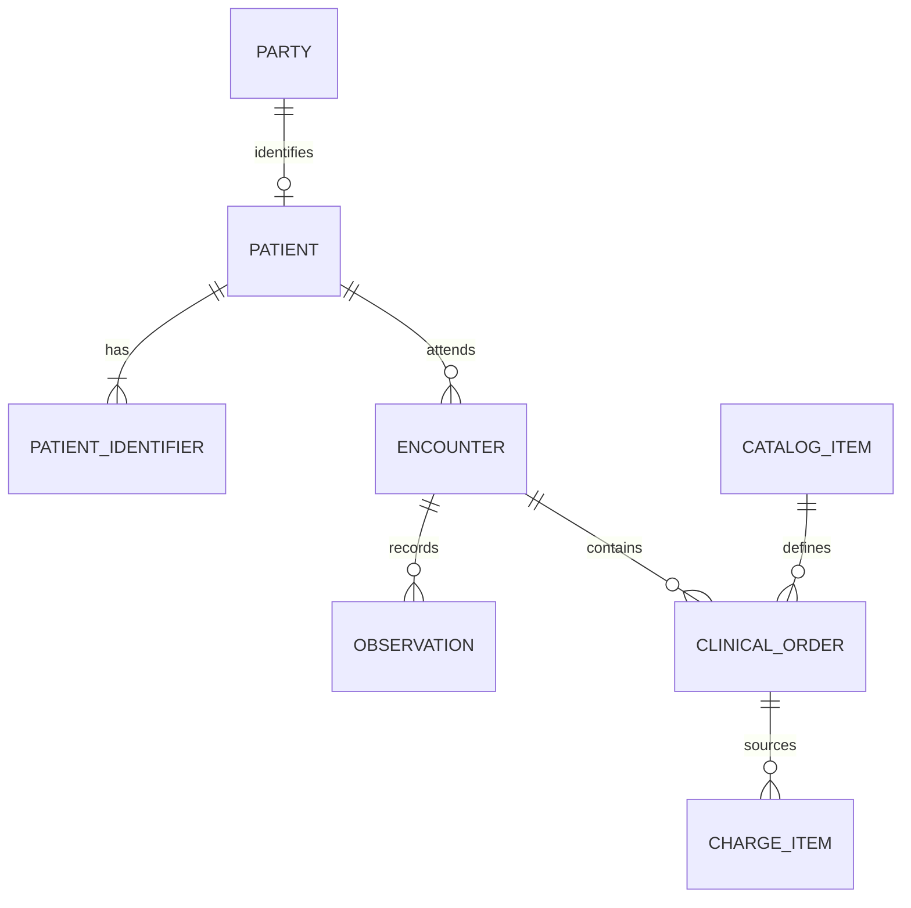

# Domain model

**Current database** มี `foundation_tenant`, `foundation_role`, `foundation_demo_identity` และ `alembic_version` เท่านั้น. ไม่มี patient/encounter rows ใน M0. ตารางด้านล่างเป็น target design ที่ต้อง review/migrate/test ใน task ที่ระบุ

| Entity | Core fields / relationships | Invariant / milestone |
|---|---|---|
| Party | party_id, person name, birth date; patient references party | Adult synthetic self only M1; no real citizen ID |
| Patient | patient_id, tenant_id, party_id, hn, patient_type | HN tenant-unique, never reused; human adult POC |
| PartyRelation | party_id, patient_id, relation_type, validity | self relation; guardian/owner flows deferred |
| PatientIdentifier | patient_id, type, value, is_preferred | generated HN; preferred uniqueness per patient/type |
| Encounter | patient_id, encounter_class=AMB, status, VN, period_start/end | starts planned; in_progress on doctor first call; status history |
| ObservationDefinition | code/system, type, UCUM unit, permitted values, reference criteria | actual field definitions, no unverified clinical cutoffs |
| Observation | patient/encounter, definition/code, typed value, unit, effective_at, performer, recorded_at, ref_low/high, parent_id | BP parent + component observations; reference snapshot |
| CatalogItem | code/system, item_type, name_th/en, orderable/billable, active_from/to, attributes | one catalog; fixed synthetic drug/Hb-only lab panel |
| Order | patient/encounter, catalog_item, type, action, previous_order_id, status, typed detail, orderer/time | revision immutable clinical payload; ADR-0002 before M3 |
| OrderStatusHistory | order_id, prior/new status, actor/time, reason | append-only transitions, not clinical content overwrite |
| Sample / SampleItem / Analysis / Result | order linkage, specimen work identifiers, performed/released state, value revision | LIS working truth separated from published Observation |
| Dispense | active order, actor, time, quantity, event ID | quantity cannot exceed remaining, cancellation concurrency checked |
| Account / PriceDefinition / ChargeItem | encounter account, price validity, source order/event, billing_label, Decimal amount | billable event triggers charge once; no paid flag invented |
| User / Role | future local authenticated identity maps to foundation identity | current fixtures have no passwords, tokens or sessions |
| AuditEvent | actor, role, tenant, patient/resource, action/outcome, time, purpose/correlation | protected reads audited as soon as introduced |
| EventOutbox / ConsumerReceipt | UUID, type/version, aggregate, reference payload, tenant/time/context, consumer key | transactionally written; unique consumer/event prevents duplicates |

ทุก patient-bearing table ต้องมี tenant_id, created_at/by, updated_at/by. Cross-tenant FKs must be prevented with composite keys/constraints or equally tested mechanism. Actor IDs must be server-derived after auth; values supplied by browser are not audit identity

Money uses Decimal/Numeric, UTC-aware timestamps use PostgreSQL timestamptz. Clinical record correction creates revision/entered_in_error history; no delete routes. Schema migration is task-owned, not auto-created on API startup. Clinical columns in Encounter, separate ad-hoc prescription table and JSONB that hides reportable clinical measurements violate selected core rules
# M1-01 patient persistence

`party` owns person identity; `patient` references Party through a tenant-scoped composite foreign key. `party_relation` stores explicit self relations. `patient_identifier` enforces one preferred value per type. HN values are allocated from a tenant counter and are never reused.
