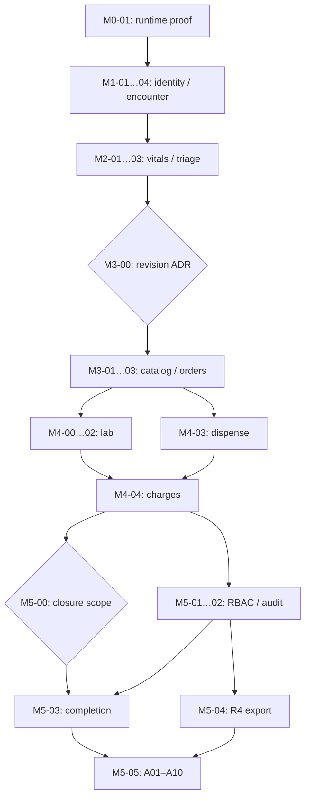

# Milestone DAG and task index

M0 เท่านั้นมี implementation. M0-01 ต้องรันบน Docker host; M1–M5 เป็น task contracts. ทำทีละ task ตาม dependency ไม่ใช่ swarm

| Task | Goal | Depends on | Status |
|---|---|---|---|
| [M0-01](tasks/M0-01.md) | Verify authoritative Compose runtime | M0 source | BLOCKED_ENVIRONMENT |
| [M1-01](tasks/M1-01.md) | Party, Patient and identifier schema | M0-01 | READY_AFTER_DEPENDENCIES |
| [M1-02](tasks/M1-02.md) | Local authorization and read-audit baseline | M1-01 | PLANNED |
| [M1-03](tasks/M1-03.md) | Patient registration and search | M1-02 | PLANNED |
| [M1-04](tasks/M1-04.md) | OPD encounter create and read | M1-03 | PLANNED |
| [M2-01](tasks/M2-01.md) | Observation definitions and values | M1-04 | PLANNED |
| [M2-02](tasks/M2-02.md) | Triage capture and workflow | M2-01 | PLANNED |
| [M2-03](tasks/M2-03.md) | Doctor arrival and allergy acknowledgement | M2-02 | PLANNED |
| [M3-00](tasks/M3-00.md) | Resolve order revision interpretation | M2-03 | BLOCKED_AMBIGUITY |
| [M3-01](tasks/M3-01.md) | Active catalog and encounter-linked orders | M3-00 | PLANNED |
| [M3-02](tasks/M3-02.md) | Order history and transactional outbox | M3-01 | PLANNED |
| [M3-03](tasks/M3-03.md) | Doctor CPOE workspace | M3-02 | PLANNED |
| [M4-00](tasks/M4-00.md) | Freeze lab subset and validation permission | M3-03 | PLANNED |
| [M4-01](tasks/M4-01.md) | Lab worklist and technical completion | M4-00 | PLANNED |
| [M4-02](tasks/M4-02.md) | Validate and release Hb Observation | M4-01 | PLANNED |
| [M4-03](tasks/M4-03.md) | Pharmacy dispense workflow | M3-03 | PLANNED |
| [M4-04](tasks/M4-04.md) | Event-derived charge and finance projection | M4-02, M4-03 | PLANNED |
| [M5-00](tasks/M5-00.md) | Resolve clinical and account completion scope | M4-04 | BLOCKED_AMBIGUITY |
| [M5-01](tasks/M5-01.md) | Complete role and tenant boundary suite | M4-04 | PLANNED |
| [M5-02](tasks/M5-02.md) | Audit evidence and disclosure boundaries | M5-01 | PLANNED |
| [M5-03](tasks/M5-03.md) | Accepted encounter completion path | M5-00, M5-02 | PLANNED_BLOCKED_BY_DECISION |
| [M5-04](tasks/M5-04.md) | Minimal FHIR R4 read/export adapter | M5-02 | PLANNED |
| [M5-05](tasks/M5-05.md) | Seeded journey and final acceptance | M5-03, M5-04 | PLANNED |

`tasks/tasks.json` เป็น machine-readable DAG; repository_check ตรวจ missing nodes/cycles ไม่ใช่ scheduler. ทุก protected route มี RBAC/audit ตั้งแต่ task ที่เพิ่ม ไม่เลื่อนไป M5
