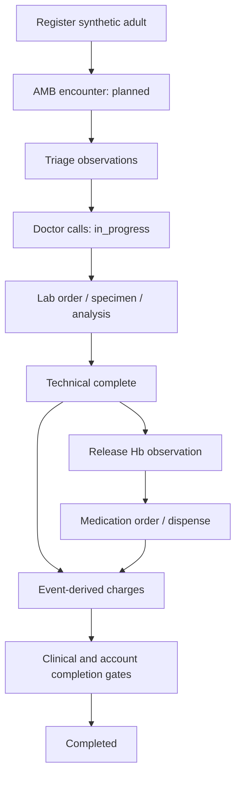

# OPD workflow — target M1–M5

M0 แสดง worklist shell เท่านั้น. ไม่มีการรักษาหรือ clinical recommendations

| Step | Actor | State and evidence |
|---|---|---|
| Register | R-REG | Party + Patient + self relation + generated HN/PatientIdentifier atomically |
| Start service | R-REG | AMB/planned, generated VN, encounter_status_history; repeated request idempotent |
| Triage | R-SCR | BP/temperature/weight Observation; allergy status explicit, no null=no-known-allergy inference |
| First doctor call | R-DOC | in_progress transition with actor/time/history |
| CPOE | R-DOC | catalog-backed lab/medication orders, Encounter linkage, revision history |
| Perform analysis | R-LAB | manual sample chain; technical_complete produces one billable fulfillment event |
| Release result | R-LAB demo exception | Hb 10.2 g/dL synthetic only; publish Observation; never produce a second CBC charge |
| Dispense | R-PHA | authorize active order and remaining quantity atomically; medication.dispensed |
| Finance view | R-FIN | billing_label/quantity/price projection only; no SOAP, diagnosis, result value, order_detail |
| Finish | R-DOC/R-FIN | signed clinical note + principal diagnosis + explicit settlement required; SG-003/004 task gates pending |

CBC fixture ต้องแสดง “CBC demo (Hb only)”. ไม่อ้างว่าตรวจ complete blood count ทางคลินิกจาก Hb ค่าเดียว. แยก technical_complete (ทำการตรวจแล้ว) กับ release (อนุมัติให้ผลปรากฏ) ตาม BR-ANC01-11; mockup label ที่ขัด SRS ไม่ใช้เป็น business rule

Order revisions/discontinuations race กับ lab/dispense ได้: later tests must reject stale active orders, keep history, and not consume a previous revision twice. Duplicate command/event retries must not create extra order fulfillment, dispense or charge
